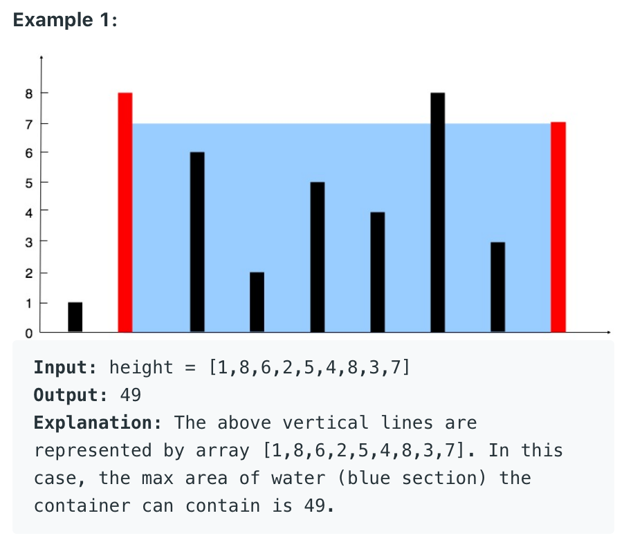

------

### 11. Container With Most Water
> Given n non-negative integers a1, a2, ..., an , where each represents a point at coordinate (i, ai). n vertical lines are drawn such that the two endpoints of the line i is at (i, ai) and (i, 0). Find two lines, which, together with the x-axis forms a container, such that the container contains the most water.
> Notice that you may not slant the container.

<!--  -->


A matrix interpretation


### 240. Search a 2D Matrix II

> Write an efficient algorithm that searches for a target value in an m x n integer matrix. The matrix has the following properties:
> 
> Integers in each row are sorted in ascending from left to right.
> Integers in each column are sorted in ascending from top to bottom.

A binary search interpretation: Why do we start from lower-left corner?  
The numbers above it are all smaller; The numbers to the right are all larger. Then itself is like a mid, helping us determine the direction for next move.
```python
def searchMatrix(self, matrix: List[List[int]], target: int) -> bool:
    if len(matrix) == 0 or len(matrix[0]) == 0:
        return False
    row, col = len(matrix) - 1, 0
    while row >= 0 and col < len(matrix[row]):
        if matrix[row][col] > target:
            row -= 1
        elif matrix[row][col] < target:
            col += 1
        else:
            return True
    return False
```
